# AirDrop Plus

A file transfer and clipboard synchronization tool between Windows and iOS devices implemented using Python and Shortcuts.

[中文](readme_zh.md)

# Buy the author a coffee
<div style="text-align:center;">
    <p>Alipay</p>
    
    <p>WechatPay</p>
    
</div>

# Requirements

```
flask==3.0.0
Babel==2.14.0      # build-time only: pybabel extract/update/compile
pillow==10.1.0
pystray==0.19.5
pyinstaller==6.2.0
windows-toasts==1.3.1
pyperclip==1.8.2
```

Install with:

```bash
pip install -r requirements.txt
```

# Project Structure

```
AirDropPlus/
├── src/                 # All source code, config and resources
│   ├── AirDropPlus.py   # Entry point
│   ├── server.py        # Flask server and routes
│   ├── config.py        # Config loading / saving
│   ├── i18n.py          # gettext-based i18n
│   ├── clipboard.py notifier.py result.py utils.py
│   ├── build.py         # PyInstaller packaging script
│   ├── babel.cfg        # pybabel extraction config
│   ├── config/          # config.ini (local) + config.ini.example (template)
│   ├── static/          # icon.ico
│   ├── templates/       # settings.html
│   └── translations/    # gettext translations (en/ru/zh)
├── docs/                # README images and API reference
├── api/                 # Bruno API test collection
├── requirements.txt
├── readme.md / readme_zh.md
└── LICENSE
```

# Run from Source

```bash
pip install -r requirements.txt
python src/AirDropPlus.py
```

On first run, copy `src/config/config.ini.example` to `src/config/config.ini` (the app reads `src/config/config.ini`).

# Packaging

```bash
python src/build.py
```

The build output is generated under `src/dist/`.

# Usage
0. Network
    
    - Your iPhone and PC must be on the same LAN, or the PC can connect to the iOS hotspot, or vice versa.
    - (It doesn't use data when transferring files via a hotspot.)
1. Install Bonjour on PC (optional)
    - Bonjour allows you to access Windows using the 'hostname.local' instead of an IP address.
    - The latest version of Bonjour may encounter issues accessing 'hostname.local'. Please use an older version instead.
    <div style="text-align:center;">
        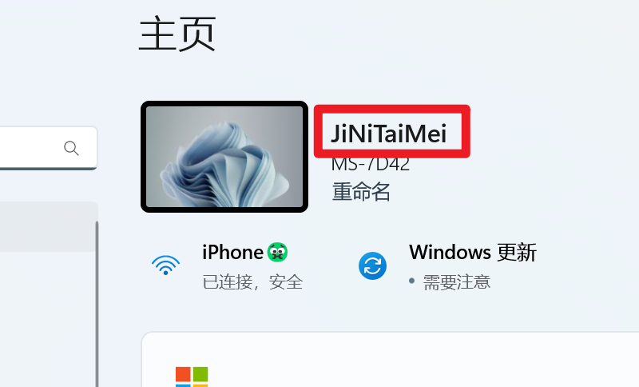
    </div>
2. Start AirDropPlus.exe

    Start 'AirDropPlus.exe', and when prompted with the following pop-up, please click to allow.
    <div style="text-align:center;">
      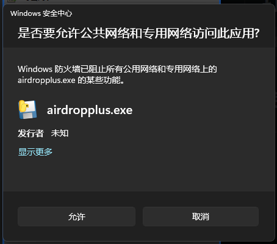
    </div>
3. Set up AirdropPlus
    - Right click on the tray icon and open Settings to configure.
4. Get the shortcut on your iPhone.
   version: 1.5.4
   https://www.icloud.com/shortcuts/c499c9a3d9b04e189cce38d9560b3e2e
      <div style="text-align:center;">
       
   </div>
5. Set up the shortcut:
   - host：'hostname.local'
   - port：The same port as that in the PC-side settings
   - key：The same key as that in the PC-side settings
   <div style="text-align:center;">
       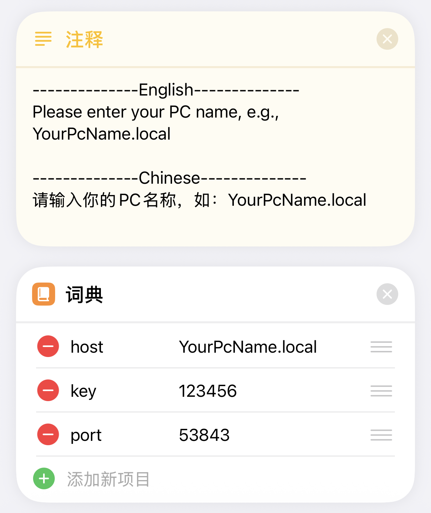
   </div>
   If your PC does not support access via 'hostname.local', you can use the PC's IP address instead. Fill in the combinations of WiFi names and PC IP addresses for all your scenarios in the list below.
   <div style="text-align:center;">
       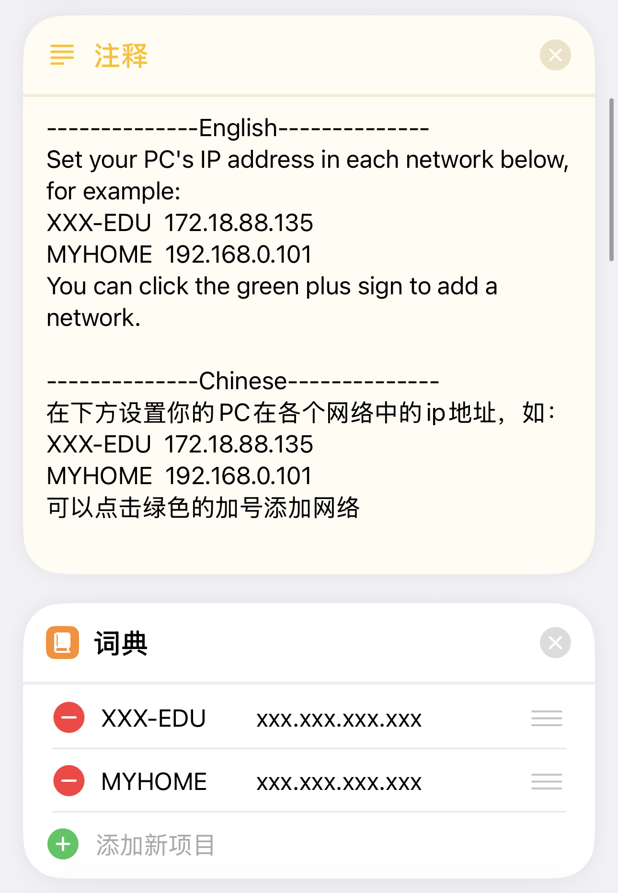
   </div>
6. Set the trigger method of the shortcut (choose one of the three methods):
   1. Set it up in 'Settings-Accessibility-Touch-BackTap' to trigger with a double-tap on the back of the iPhone.
   2. The iPhone 15 Pro series can set it to trigger with the side button.
      <div style="text-align:center;">
        
      </div>
   3. Newer versions of iOS can add 'AirDrop Plus' shortcuts to the Control Center.
      <div style="text-align:center;">
        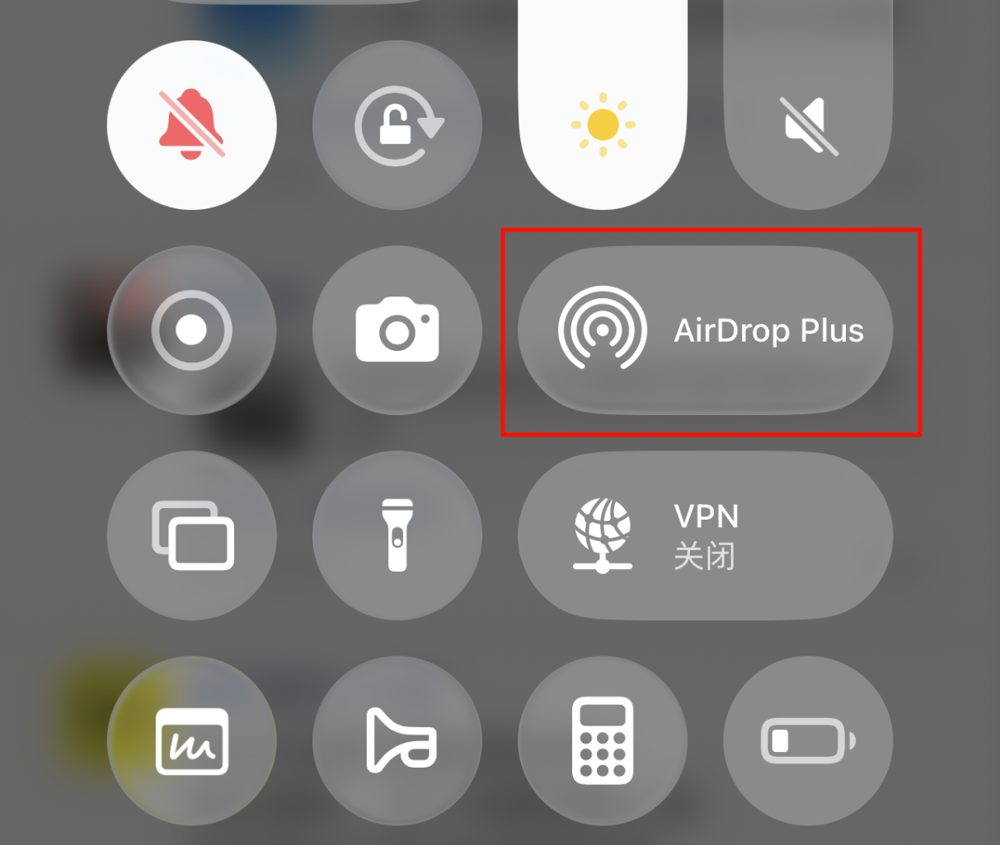
      </div>
7. Remove the limit on the number of files sent via Shortcuts (Not performing this setting will cause an error when sending multiple images)
  iPhone - Settings - App - Shortcuts - Advanced - Allow Sharing Large Amounts of Data
8. Functionality Testing:
    - **Send files**:
      Add the 'AirDrop Plus' shortcut to the file sharing menu.
      <div style="text-align:center;">
        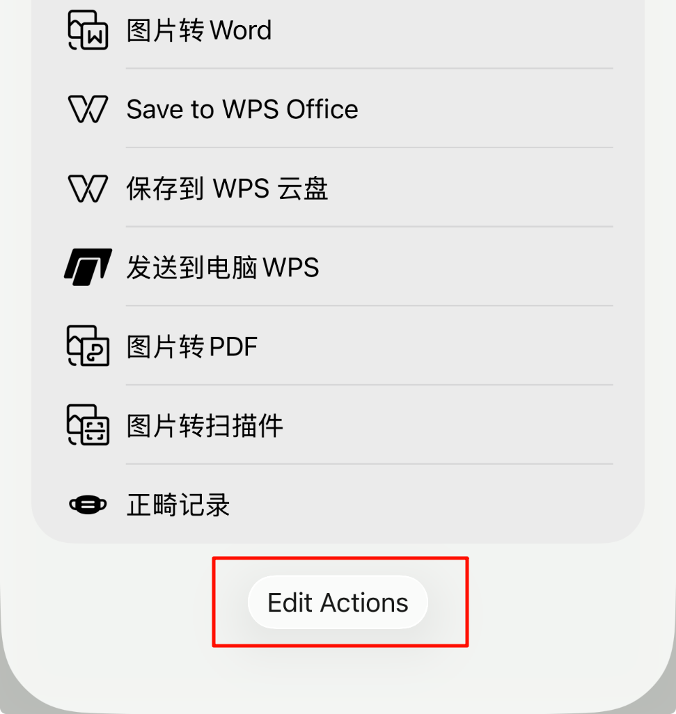
      </div>
      <div style="text-align:center;">
        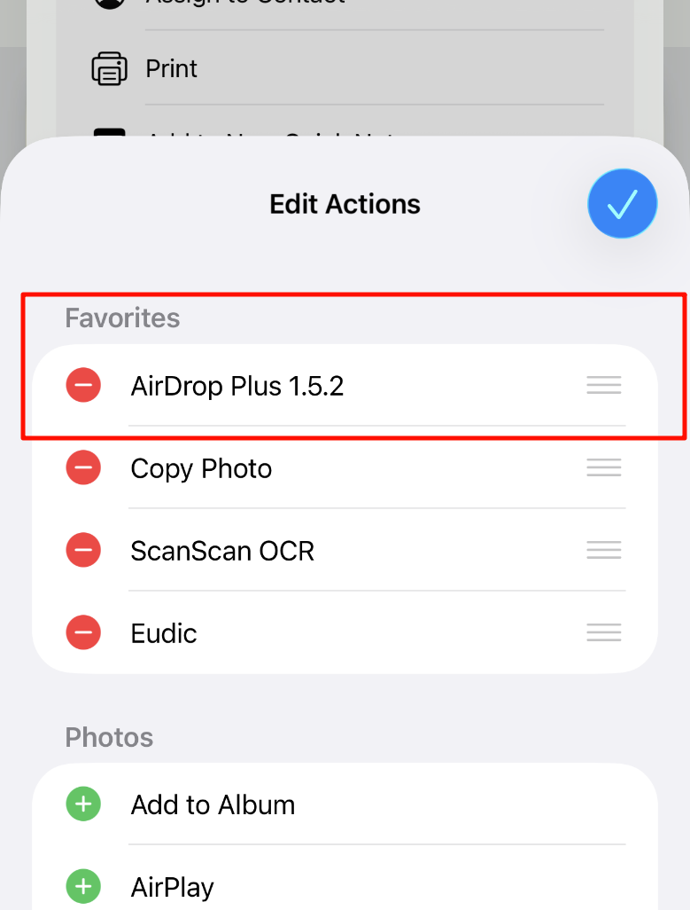
      </div>
      Tap the 'AirDrop Plus' shortcut from the file sharing menu.
      <div style="text-align:center;">
        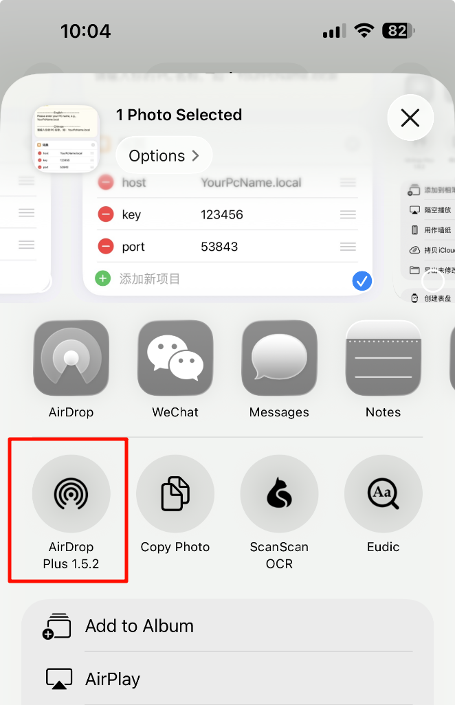
      </div>
      PC will receive the file and show a notification.
      <div style="text-align:center;">
        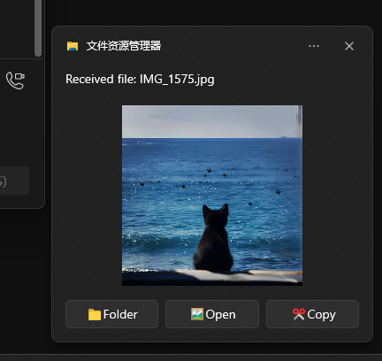
      </div>
   - **Send texts**:
     1. Copy the text which you want to send.
     2. Trigger the shortcut, then tap the 'Send' option.
     <div style="text-align:center;">
       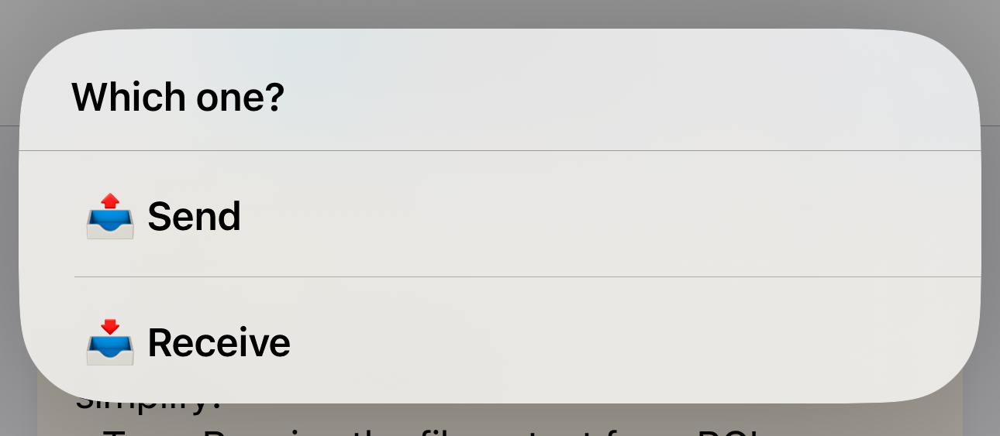
     </div>
   - **Receive files or texts**: 
     1. Trigger the shortcut
     2. Tap the 'Receive' option to receive file or text from PC's clipboard.
     <div style="text-align:center;">
       
     </div>

# Issues and solutions
### 1. Shortcut Timeout:
1. Check if the local area network (LAN) environment is unobstructed. In campus network environments, communication with LAN devices may be prohibited.
2. Check if the port in the PC-side settings is the same as that set in the shortcut commands.
3. Ensure that the hostname set in the shortcut is consistent with **the PC's hostname** (the hostname should not be in Chinese and should not contain '-'). You can also try changing **hostname.local** to **IP address**.
4. Check if the PC's firewall is blocking the port set in the **config.ini** file. Remove all entries related to AirDropPlus and restart AirDropPlus. After the restart, please allow the pop-up for network requests.
    <div style="text-align:center;">
      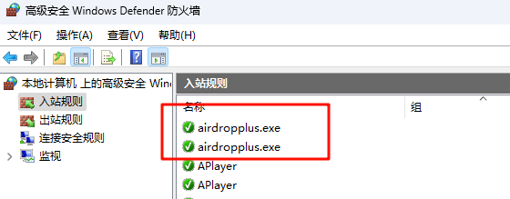
      
    </div>

### 2. No notification after startup, but the process is running in the background:
1. It's possible that the PC's system version is too old to support interactive notifications. Try changing to basic notifications in the **config.ini** file.
    <div style="text-align:center;">
      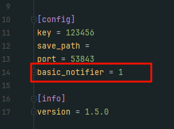
    </div>

# API

See [docs/api.md](docs/api.md) for the full HTTP API reference.
